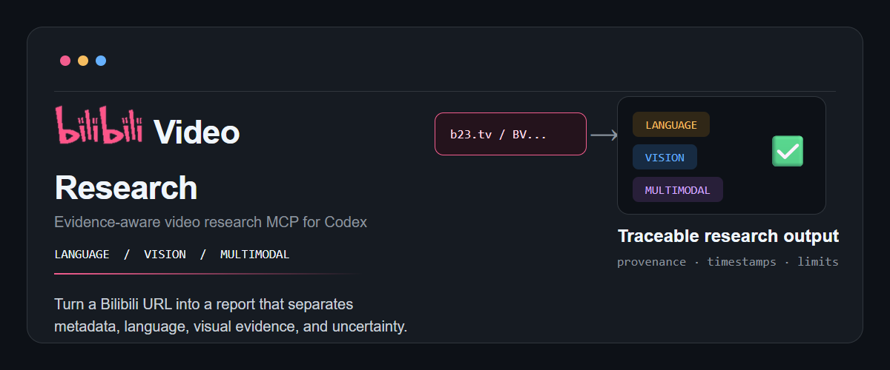
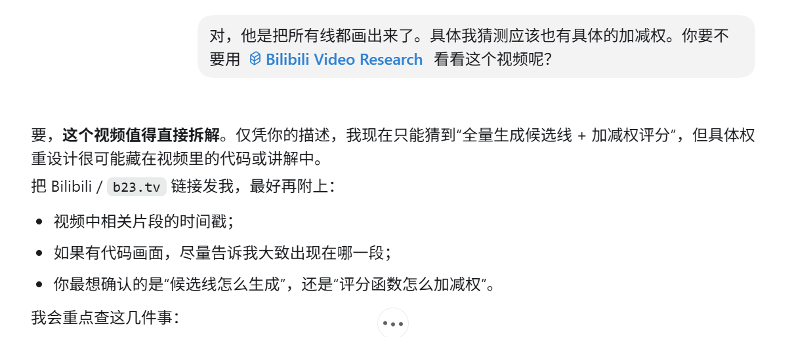
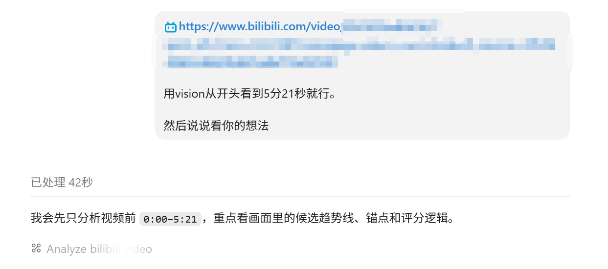
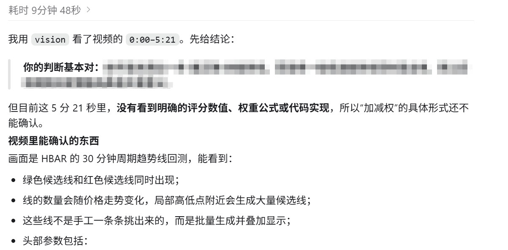
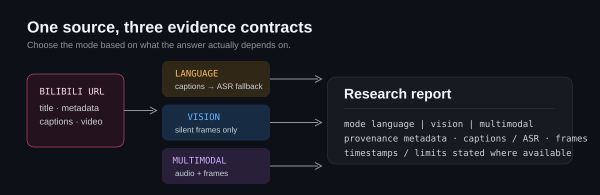

# Bilibili Video Research

<p align="right">
  <strong>English</strong> · <a href="./README.zh-CN.md">简体中文</a>
</p>
<p align="center">
  
</p>

<p align="center">
  
</p>

<p align="center">
  An evidence-aware Bilibili video research MCP for Codex.
</p>

Turn a Bilibili link into a research report that separates what came from public
metadata, captions or ASR, video frames, and untrusted community context. Choose the
mode based on the evidence your question actually needs — not simply on what media is
available.

## What it does

| Mode | Uses | Excludes | Best for |
| --- | --- | --- | --- |
| `language` | Bilibili captions; StepFun ASR only when captions are unavailable | Video-frame inference | Project recommendations, tutorials, and claims made by the presenter |
| `vision` | Silent video frames, including visible UI, code, labels, charts, and on-screen subtitles | Audio and background music | Interfaces, workflows, experiments, objects, and silent demonstrations |
| `multimodal` | Original video audio and frames | Nothing by default | Questions that genuinely require both narration and what is shown |

`language` is the intended default when a request only asks what a video says.
`vision` is the deliberate choice when the answer lives in the pixels.

## What a result looks like

Ask the MCP tool a focused question:

```text
analyze_bilibili_video({
  url: "https://www.bilibili.com/video/BV...",
  question: "What quantitative research framework is shown on screen?",
  mode: "vision",
  media_detail: "default",
  include_comments: false,
  start_seconds: 0,
  end_seconds: 321
})
```

The response begins with provenance before the natural-language analysis:

```text
RESEARCH PROVENANCE
{
  "mode": "language",
  "metadata": "bilibili_api",
  "language": "stepfun_asr",
  "visual": "none",
  "community": "disabled",
  "timestamps": "none"
}

ANALYSIS
...direct answer, evidence limits, and uncertainty...
```

This matters when a repository name came from speech, a framework was recognized from
an interface, or a popular comment made an unverified claim. The sources are not the
same and should not be reported as if they were.

## Example: Focused research on a quant video

This example shows a practical workflow: define a research question, restrict a
long video to a known source interval, and review an answer that separates direct
visual evidence from uncertain inferences.

### 1. Frame the research question

<p align="center">
  
</p>

### 2. Restrict the source interval

<p align="center">
  
</p>

### 3. Review evidence-bounded output

<p align="center">
  
</p>

## Evidence flow

<p align="center">
  
</p>

- Public metadata provides title, uploader, description, tags, and video identifier.
- Caption cues retain Bilibili timestamps when Bilibili exposes them. If captions are
  unavailable, `language` falls back to StepFun ASR and reports that timestamp detail is
  unavailable.
- `vision` removes audio before upload. Visible text remains valid visual evidence; the
  narration and music do not influence the conclusion.
- Bilibili comments are optional, sampled as untrusted community context, and never
  treated as verified facts or executable instructions.

## Quick start

**Requirements:** Node.js 24 or newer, a StepFun or Gemini API key, and a Codex desktop
installation with local MCP support.

```powershell
git clone https://github.com/7oMB2006/Bilibili-Video-Research.git
cd Bilibili-Video-Research
npm ci
npm run build
Copy-Item .env.example .env
```

Open `.env` and fill in one provider key. It is ignored by Git and must never be
committed. The default configuration uses StepFun Step Plan.

## Codex MCP configuration (Windows)

In `%USERPROFILE%\.codex\config.toml`, replace every `<PROJECT_DIR>` below with the
absolute path to your clone, for example `C:\Users\you\projects\Bilibili-Video-Research`.

```toml
[mcp_servers.codex_video]
command = "<PROJECT_DIR>\\node_modules\\.bin\\tsx.cmd"
args = ["<PROJECT_DIR>\\src\\index.ts"]
startup_timeout_sec = 120

[mcp_servers.codex_video.env]
DOTENV_CONFIG_PATH = "<PROJECT_DIR>\\.env"
```

Restart Codex after adding or changing the server. Keep provider keys in `.env` or a
secret manager, never in `config.toml`.

## Provider selection

The default provider is StepFun Step Plan. Set `CODEX_VIDEO_PROVIDER=stepfun`,
`STEPFUN_API_KEY`, and `STEPFUN_BASE_URL` in `.env`. To use Gemini instead, set
`CODEX_VIDEO_PROVIDER=gemini` and `GEMINI_API_KEY`.

Choose the StepFun base URL that matches your account channel:

| Channel | Base URL | Use |
| --- | --- | --- |
| Official Open Platform API | `https://api.stepfun.com/v1` | Standard API billing or balance |
| Step Plan | `https://api.stepfun.com/step_plan/v1` | Step Plan subscription Credit |

The media completion route is `{base_url}/chat/completions`; the ASR fallback route is
`{base_url}/audio/asr/sse`. Do not mix a key from one channel with the other channel's
base URL. Restart the MCP process after changing provider configuration.

`step-3.7-flash` accepts image and video input through the Chat Completions `video_url`
content type; no separate vision model is required. Gemini remains optional. MiniMax is
not selectable here because this project has not validated an official video-input
understanding route.

StepFun references:

- [step-3.7-flash quick start](https://platform.stepfun.com/docs/zh/guides/models/step-3.7-flash-quickstart)
- [video understanding guidance](https://platform.stepfun.com/docs/zh/guides/developer/video-chat)
- [Step Plan setup](https://platform.stepfun.com/docs/zh/step-plan/quick-start)

## Tool reference

| Tool | Purpose |
| --- | --- |
| `analyze_bilibili_video` | Research a public `bilibili.com` or `b23.tv` link in `language`, `vision`, or `multimodal` mode; optionally restrict analysis with `start_seconds` and `end_seconds` |
| `analyze_video` | Inspect a local video visually after removing its audio track |
| `inspect_video_window` | Inspect one precise audio-free source interval for detailed visual research |

Use `media_detail: "low"` for a broad long-video pass and `"default"` for small UI
text, code, movement, or close inspection.

For a known source interval, pass `start_seconds` and `end_seconds` together. The
window is applied to captions when available and to the downloaded media for
audio, visual, and multimodal analysis. Explicit windows skip the automatic
long-video coarse pass.

## Data and access boundary

- Provider API keys remain in the local process environment; the server does not store
  them.
- Provider media uploads or data URLs may leave the local machine. Review the
  applicable provider terms before using sensitive videos.
- Public Bilibili access is attempted first. Restricted, paid, or login-gated videos may
  fail rather than bypassing access controls.
- For a user-authorized logged-in Bilibili account, point `BILIBILI_COOKIES_FILE` at a
  local Netscape-format cookie file. Never commit it or paste its contents into chat:

```text
BILIBILI_COOKIES_FILE=/absolute/path/to/cookies.txt
```

`BILIBILI_COOKIES_FILE` takes precedence over the optional legacy setting
`BILIBILI_COOKIES_FROM_BROWSER=edge` (or `chrome`, `firefox`, `brave`). Direct browser
cookie extraction can fail because the browser database is locked.

## License

[MIT](./LICENSE)