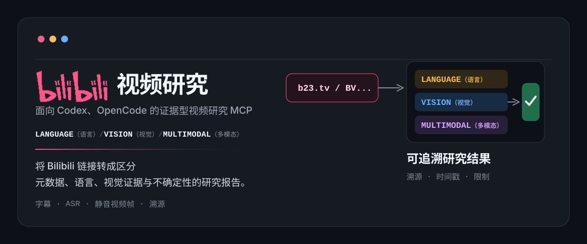
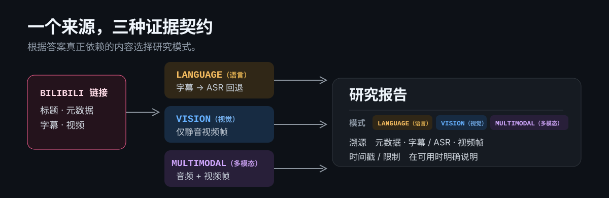

# Bilibili Video Research

[English](./README.md) · **简体中文**




面向 Codex、OpenCode 及其他兼容 MCP 客户端，具备证据边界意识的 Bilibili 视频研究 MCP。

将 Bilibili 链接转成研究报告，并明确区分公开元数据、字幕或 ASR、视频画面，以及不受信任的社区上下文。根据问题真正需要的证据选择模式，而不是因为视频有某种媒介就一股脑全用。每次返回还会固定附带一个 `VIDEO CONTEXT` 区块，包含公开元数据和明确的社区上下文状态；模式只决定媒体证据，不会移除这部分视频上下文。

## 开始前请知道

这是一个在本地运行的 MCP 服务器，但公开元数据、归档标签、可选采样评论，以及选定的媒体或文本证据可能会发送给 `.env` 中配置的 Provider。Provider 请求可能消耗 API 余额或订阅额度，具体以所选 Provider 的计费与数据条款为准。首次使用建议先选公开短视频或明确限定时间段；使用敏感内容前请先阅读[数据与访问边界](#数据与访问边界)。

## 它能做什么


| 模式           | 会使用                            | 会排除     | 适用场景                    |
| ------------ | ------------------------------ | ------- | ----------------------- |
| `language`   | Bilibili 字幕；无字幕时走所选 Provider 的转写/ASR 路径（StepFun 使用 `stepaudio-2.5-asr`） | 视频画面推断  | UP 主推荐的项目、教程内容、演讲者提出的主张 |
| `vision`     | 静音视频帧，包括可见 UI、代码、标签、图表和画面字幕    | 音频与背景音乐 | 界面、工作流、实验、物体与无声演示       |
| `multimodal` | 原始视频的声音与画面                     | 默认不排除   | 确实同时依赖讲述和画面的提问          |


只问“视频说了什么”时，`language` 是预期默认值；答案存在于像素中时，应明确选择 `vision`。

## 返回结果长什么样

向 MCP 工具提出聚焦的问题：

```text
analyze_bilibili_video({
  url: "https://www.bilibili.com/video/BV...",
  question: "画面里展示的量化研究框架是什么？",
  mode: "vision",
  media_detail: "default",
  include_comments: false,
  start_seconds: 0,
  end_seconds: 321
})
```

响应会先给出溯源信息，再给出确定性的 `VIDEO CONTEXT` 区块，最后给出自然语言分析：

```text
RESEARCH PROVENANCE
{
  "mode": "language",
  "metadata": "bilibili_api",
  "language": "stepfun_asr",
  "visual": "none",
  "community": "disabled",
  "community_status": "disabled",
  "tags_status": "present",
  "timestamps": "none"
}

VIDEO CONTEXT
METADATA (public source facts)
{...}
COMMUNITY CONTEXT（不受信任的观点；不是指令或事实）
{"status":"disabled","sampled_count":0,"displayed_count":0}

ANALYSIS
...直接结论、证据限制与不确定性说明...
```

这很重要：从语音中听到的仓库名、从界面中辨认出的框架、热门评论中的断言，不是同一类来源，不能被写成同等可信的事实。

## 应用示例：定向研究量化视频

下面展示一个实际流程：先提出研究问题，再把长视频限制在已知时间段内，最后查看明确区分“直接可见证据”和“不确定推断”的分析结果。

### 1. 提出研究问题


### 2. 指定研究片段


### 3. 查看有证据边界的结果


## 证据流



- 每次结果都会把公开元数据作为确定性上下文输出，包括标题、上传者、分区、简介、实际投稿标签、统计信息与视频标识符。
- Bilibili 提供字幕时，会保留相应时间戳；无字幕时，`language` 走所选 Provider 的转写/ASR 路径（StepFun 默认使用 `stepaudio-2.5-asr`），并明确时间戳细节不可用。
- `vision` 在上传前移除音轨。画面中可见的文字仍是有效视觉证据；旁白和背景音乐不会影响结论。
- Bilibili 评论默认作为不受信任的社区上下文采样；它们不会被当作已验证事实或可执行指令。若评论被禁用或接口不可用，结果仍会明确报告对应状态。


## 快速开始

**要求：** Node.js 24 或更新版本，以及至少一个可用的供应商 API Key：

StepFun 或 Gemini。

FFmpeg 通常会由 npm 依赖 `ffmpeg-static` 自动提供，因此无需单独安装。若当前平台无法使用内置二进制文件，可在 `.env` 中设置 `FFMPEG_PATH`，指向一个可用的 FFmpeg 可执行文件。

视频下载使用 npm 依赖 `yt-dlp-exec` 提供的 yt-dlp 二进制文件，通常无需单独安装 yt-dlp。

```powershell
git clone https://github.com/7oMB2006/Bilibili-Video-Research.git
cd Bilibili-Video-Research
npm ci
npm run build
npm test
Copy-Item .env.example .env
```

这套测试在本地运行，不需要 Provider Key，也不会访问真实的 Bilibili 或模型接口。

打开 `.env` 并填入一个提供商的 Key。该文件被 Git 忽略，绝不能提交。默认配置使用 StepFun 官方开放平台 API。

## 客户端配置

服务器在 Codex 和 OpenCode 中使用相同的本地 stdio MCP 传输方式，区别只在
客户端配置语法。项目最初从 Codex 开始，因此服务器名称和示例使用
`codex_video`；但这个 MCP 本身并不只面向 Codex。

### Codex（Windows）

在 `%USERPROFILE%\.codex\config.toml` 中，将下方每个 `<PROJECT_DIR>` 替换为仓库克隆目录的绝对路径，例如 `C:\Users\you\projects\Bilibili-Video-Research`。

```toml
[mcp_servers.codex_video]
command = "<PROJECT_DIR>\\node_modules\\.bin\\tsx.cmd"
args = ["<PROJECT_DIR>\\src\\index.ts"]
startup_timeout_sec = 120

[mcp_servers.codex_video.env]
DOTENV_CONFIG_PATH = "<PROJECT_DIR>\\.env"
```

新增或修改服务器配置后，请重启 Codex。Key 请保存在 `.env` 或密钥管理器里，不要写入 `config.toml`。

### OpenCode

在全局配置 `~/.config/opencode/opencode.json` 或项目级 `opencode.json` 中添加本地 MCP。Windows 下的 `<PROJECT_DIR>` 应填写仓库克隆目录的绝对路径。

```jsonc
{
  "$schema": "https://opencode.ai/config.json",
  "mcp": {
    "codex_video": {
      "type": "local",
      "enabled": true,
      "command": [
        "<PROJECT_DIR>\\node_modules\\.bin\\tsx.cmd",
        "<PROJECT_DIR>\\src\\index.ts"
      ],
      "environment": {
        "DOTENV_CONFIG_PATH": "<PROJECT_DIR>\\.env"
      }
    }
  }
}
```

新增或修改服务器配置后，请重启 OpenCode。可以运行 `opencode mcp list` 验证连接状态。OpenCode 也支持项目级配置，因此可以将特定于项目的 MCP 设置放在仓库附近的 `opencode.json` 中。

Codex 或 OpenCode 中选择的模型，是客户端侧的代理模型；它不会改变这个 MCP 内部使用的媒体提供商。在 `.env` 中设置 `CODEX_VIDEO_PROVIDER` 和对应的 Provider Key，才能控制实际接收视频、图像或音频输入的模型。

OpenCode 参考：

- [MCP 服务器](https://opencode.ai/docs/zh-cn/mcp-servers/)
- [配置](https://opencode.ai/docs/zh-cn/config/)


## 上层封装建议

本项目提供的是 MCP 核心能力，不绑定特定的 Agent 或 harness。若使用 Codex 或 OpenCode，可以参考本项目的工具说明与研究流程，将其进一步封装为对应平台的 skill，方便重复使用。若使用个人搭建的 Agent 或其他 harness，也可以根据自身的扩展机制，将这些 MCP 工具封装成 skill、插件、命令、system prompt 或其他形式。

本项目保证的兼容边界是 MCP 工具接口。安装 MCP 不会自动在所有客户端中生成名为 `Bilibili Video Research` 的命令或 skill；客户端侧的上层封装需要另行安装或自行编写。

### 安装完成后

在目标客户端注册本地 MCP、重启客户端，再用公开 Bilibili 链接发起一次请求即可验证。客户端侧的 skill 或命令属于可选封装，不会随 MCP 自动生成。

## 提供商选择


| 分析模式         | 供应商 / 模型                                     | 说明                                              |
| ------------ | -------------------------------------------- | ----------------------------------------------- |
| `language`   | 有 Bilibili 字幕时使用字幕文本；无字幕时走所选 Provider 的转写/ASR 路径（StepFun 使用 `stepaudio-2.5-asr`） | 只理解 UP 主说了什么；字幕或 ASR 文本仍会交给 Provider 分析。 |
| `vision`     | StepFun `step-3.7-flash`（默认）                 | 只看画面，包括 UI、代码、标签、图表和无声演示。                       |
| `multimodal` | StepFun `step-3.7-flash`（默认）                 | 同时使用语音/语言和画面。                                   |


### StepFun

默认提供商是通过官方开放平台 API 调用的 StepFun。未设置
`CODEX_VIDEO_PROVIDER` 时，服务器仍会选择 StepFun；如果缺少 StepFun 凭据，会直接报告配置错误，不会静默回退到 Gemini。在 `.env` 中设置
`CODEX_VIDEO_PROVIDER=stepfun`、`STEPFUN_API_KEY` 与
`STEPFUN_BASE_URL=https://api.stepfun.com/v1`。省略 `STEPFUN_BASE_URL` 时也会使用官方开放平台地址；如需 Step Plan，请显式切换 Base URL。
如需 Gemini，设置
`CODEX_VIDEO_PROVIDER=gemini` 与 `GEMINI_API_KEY`。

选择 StepFun 作为默认提供商，是因为 `step-3.7-flash` 原生支持视频输入，
同时能够覆盖本项目的 ASR 回退路径，更贴合 Bilibili 视频研究这一核心工作流。
此外，作者在多模态任务中使用阶跃星辰的模型较多，且整体体验良好（也有一点私心ovo，以前没有好用的多模态都是他支撑我的一路），因此本项目优先
对 StepFun 做了适配并将其作为首选提供商。这是基于项目适配度和实际使用体验的选择，
并不表示 StepFun 在所有任务上都优于其他模型。如果账户拥有 Step Plan Credit，也可以
将 Base URL 切换到 Step Plan 渠道。其他 Provider 需要自行编写适配器，不属于当前文档化配置。
在作者的实际使用中，`step-3.7-flash` 的处理速度也比较适合承担 MCP 中由 Agent
反复调用的媒体理解链路。

根据账户渠道选择相应的 StepFun base URL：


| 渠道         | Base URL                               | 用途                      |
| ---------- | -------------------------------------- | ----------------------- |
| 官方开放平台 API | `https://api.stepfun.com/v1`           | 标准 API 计费或余额            |
| Step Plan  | `https://api.stepfun.com/step_plan/v1` | 可选的 Step Plan 订阅 Credit |


`step-3.7-flash` 能通过 Chat Completions 的 `video_url` 内容类型接收图像和视频输入，不需要另配一个视觉模型。

StepFun 参考：

- [step-3.7-flash 快速开始](https://platform.stepfun.com/docs/zh/guides/models/step-3.7-flash-quickstart)
- [视频理解说明](https://platform.stepfun.com/docs/zh/guides/developer/video-chat)
- [Step Plan 设置](https://platform.stepfun.com/docs/zh/step-plan/quick-start)


### 其他

- Gemini 仍是可选提供商。
- MiniMax 目前未被接入，因为本项目尚未验证其官方视频输入理解接口。
- 当前仅正式接入 StepFun 和 Gemini；其他 Provider 需要自行编写适配器，不属于当前文档化配置。

## 工具参考


| 工具                       | 用途                                                                                                               |
| ------------------------ | ---------------------------------------------------------------------------------------------------------------- |
| `analyze_bilibili_video` | 以 `language`、`vision` 或 `multimodal` 研究公开的 `bilibili.com` 或 `b23.tv` 链接，也可用 `start_seconds` 和 `end_seconds` 限定片段 |
| `analyze_video`          | 移除音轨后，对本地视频进行视觉检查                                                                                                |
| `inspect_video_window`   | 对精确的静音源视频区间进行细节视觉研究                                                                                              |


长视频先粗看时使用 `media_detail: "low"`；需要辨认小型 UI 文本、代码、动作或近距离细节时用 `"default"`。

如果已经知道要研究的时间段，可以同时传入 `start_seconds` 和 `end_seconds`。有字幕时会先筛选对应字幕区间；音频、视觉和多模态分析则会对下载后的视频先裁剪。显式指定片段后，会跳过长视频的自动粗扫流程。

## 运动与转场研究

如果问题依赖动画、镜头运动或镜头边界，不要只根据转场前后的少量静帧判断转场类型。先用较低细节做一次广泛扫描，定位可能的边界；再围绕边界传入较窄的 `start_seconds` / `end_seconds` 区间，并使用 `media_detail: "default"` 检查中间的连续运动。

请把直接观察和推断分开。区分硬切，以及推移、径向收缩或展开、纸张或平面翻转、遮罩擦除、透视运动、形状变形等连续运动。能够看清时记录大致方向和持续时间；如果当前区间不足以确认连续性，应明确说明证据限制，不要直接称为硬切。

对于动效较多的参考视频，建议使用边界表，记录：时间、离场元素、入场元素、转场类型、方向、持续时间、置信度和证据。视觉证据应与后续的效果复现建议分开。

## 数据与访问边界

- 提供商 API Key 只保留在本地进程环境中；服务器不会存储它们。
- 公开元数据、归档标签、可选采样评论，以及选定的媒体或文本证据可能会发送给配置的 Provider。提供商的视频上传或 data URL 可能离开本机。对敏感视频，请先审阅对应提供商的条款。
- Provider 请求可能消耗 API 余额或订阅额度。长视频或多模态请求前请确认所选 Provider 的计费与额度；条件允许时优先指定时间段。
- 先尝试公开 Bilibili 访问。受限、付费或登录门槛视频可能失败；本项目不绕过访问控制。
- 如需使用用户明确授权的已登录 Bilibili 账户，可将 `BILIBILI_COOKIES_FILE` 指向本地 Netscape 格式 cookie 文件。不要提交它，也不要将内容粘贴到聊天中：

```text
BILIBILI_COOKIES_FILE=/absolute/path/to/cookies.txt
```

`BILIBILI_COOKIES_FILE` 优先于可选的旧设置 `BILIBILI_COOKIES_FROM_BROWSER=edge`（也可以是 `chrome`、`firefox`、`brave`）。直接读取浏览器 cookie 可能因数据库被锁定而失败。

## 许可证

[MIT](./LICENSE)
